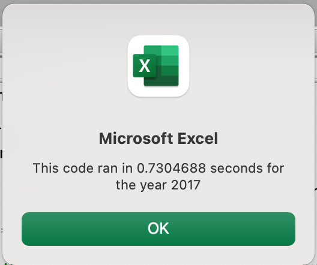
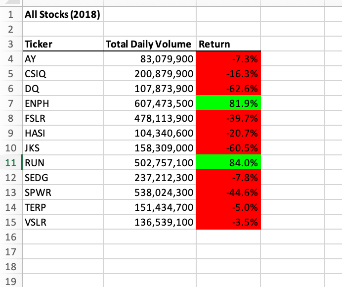
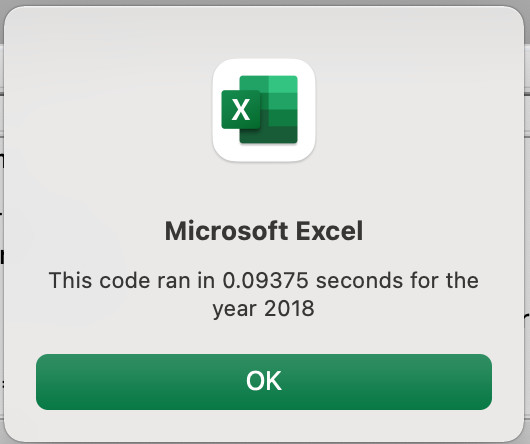

# VBA_challenge.xlsm is contains a REFACTORED subroutine from green_stocks.xlsm, which was generated during the Module 2 exercise. Both .xlsm files calculate annual cumulative volumes and annual returns for 12 stocks during years 2017 & 2018 to produce equivalent values.

## The **VBS_Challenge.xlsm** file contains a **Subroutine** called ***"AllStocksAnalysisRefactored"*** in **Module 12** that analyses 12 stocks by using a single FOR Loop over the 3012 data rows to compare the tickers in the tickers index to the tickers in the data rows for each of the 12 stocks. **VBS_Challenge.xlsm** also contains a **Subroutine** called ***"AllStocksAnalysis"*** in **Module 5** that analyses 12 stocks by using a FOR Loop over 12 stock index numbers and a nested FOR Loop over 3012 data rows. Note that the **AllStocksAnalysis** Sub is also contained in the green_stocks.xlsm file.

  * The 2 Subroutines described above output the same annual volumes and returns for the 12 stocks but Sub **AllStocksAnalysis** requires 8X of the time to run that **AllStocksAnalysisRefactored"** requires.
   
  * Hence, the **AllStocksAnalysisRefactored** Sub is the better solution for our analysis.

  * The comments in the VBS_Challenge.vbs file that came with the Challenge 2 exercise provided an excellent sequence of coding steps that was needed to ensure proper program execution of **Sub AllStocksAnalysisRefactored.**

  1.) The array lenghts depended on the number of stocks being analysed - 12 in our exercise.

  2.) The 12 stock tickers in the tickers index had to be input manually, which could present an issue if 50-5000 were being analysed. 

  3.) The tickerIndex provided the Index number for the tickers, tickerVolumes, tickerStartingPrices, and tickerEndingPrices arrays.

  4.) The tickerVolumes values were initialized to zero, using the tickerIndex, before the start of tickerVolumes calculations.

  5.) After the previous step completed, the tickerIndex was 12. Therefore, I had to reset the tickerIndex to zero before the data row For Loop began. 

  6.)  Note: the 2017 or 2018 worksheets had to be activated prior to the calculation steps.

  7.) When the Data-rows For-Loop executed, the calculations for the cumulative volume, tickerStartingPrices, and tickerEndingPrices were done. After the tickerEndingPrices were determing for each stock, the tickerIndex was increased by 1 until the For-Loop cycled through all of the data rows.

  8.)  The "All Stocks Analysis" worksheet was activated before the tickerVolumes, tickerStartingPrices, and tickerEndingPrices were written. Also, formatting at the top of the subs was undertaken while the **All Stocks Analysis** worksheet was activated.

  9.) The values in the "All Stocks Analysis" worksheet were then formatted.

  * Note that the **All Stocks Analysis** worksheet contains buttons for both of the subroutines. 

  * The PNG files from the **AllStocksAnalysis** and **AllStocksAnalysisAnalysisRefactored** Subs are attached below.

